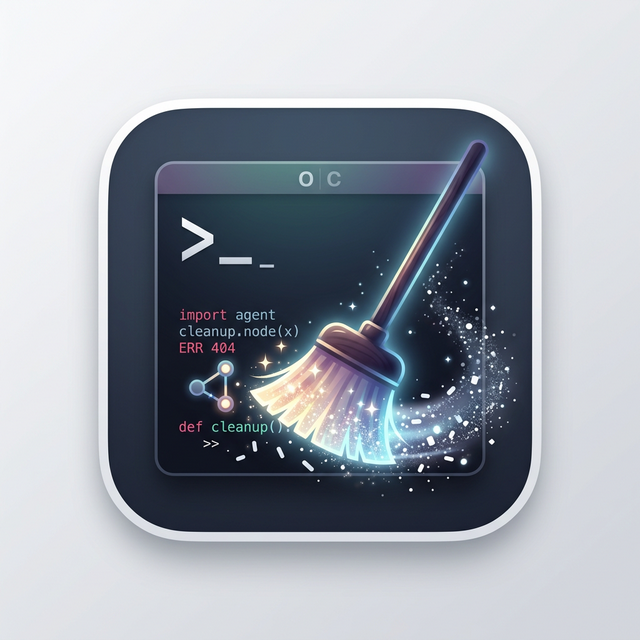

<p align="center">
  
</p>

<h1 align="center">OpenAgentCleaner</h1>

<p align="center">
  Clean leftover AI assistant files on your Mac, with a guided CLI for humans and a structured mode for agents.
</p>

<p align="center">
  <a href="https://github.com/carlisle0615/OpenAgentCleaner/actions/workflows/ci.yml"></a>
  <a href="https://github.com/carlisle0615/OpenAgentCleaner/releases"></a>
  <a href="LICENSE"></a>
</p>

OpenAgentCleaner is a macOS-first cleanup tool for local AI assistants. It focuses on assistant-specific leftovers such as logs, caches, models, session stores, launch agents, and local state. The workflow stays conservative: scan first, classify clearly, confirm explicitly, then delete.

The default command is `oac`.

## Why OpenAgentCleaner

- Built for normal users: start from `oac`, scan first, and delete with clear confirmation.
- Built for power users: JSON output, non-interactive mode, and script-friendly guardrails.
- Built for assistant-specific cleanup: not just caches, but sessions, launch agents, models, and state.
- Built to be conservative: `manual` paths stay review-only.

## Quick Start

Install the latest release:

```bash
curl -fsSL https://raw.githubusercontent.com/carlisle0615/OpenAgentCleaner/main/install.sh | bash
```

Open the guided home screen:

```bash
oac
```

Scan without deleting anything:

```bash
oac scan
```

Browse leftovers and OpenClaw conversations in the TUI:

```bash
oac analyze
oac analyze --assistant openclaw
oac analyze --assistant openclaw --before 2026-03-01
```

Clean only recommended leftovers:

```bash
oac clean
oac clean --dry-run
```

Run in agent mode:

```bash
oac scan --mode agent --json
oac clean --mode agent --yes --json
```

## Supported Today

- `macOS`
- `openclaw`
- `ironclaw`
- `ollama`

## Safety

OpenAgentCleaner classifies discovered paths into three buckets:

- `safe`: disposable logs, caches, and runtime leftovers.
- `confirm`: persistent state that should only be removed intentionally.
- `manual`: review-only paths that are never auto-deleted.

This is intentionally conservative. For example:

- OpenClaw workspaces are not auto-deleted.
- Ollama SSH keys are not auto-deleted.
- Agent mode refuses real deletion unless `--yes` is present.

## Analyze Mode

`oac analyze` is the product-style workflow for humans.

- Browse assistants from one screen.
- Inspect leftovers in a two-pane TUI.
- Review OpenClaw conversations separately from other files.
- Filter OpenClaw conversations by date.
- Delete one conversation, one leftover item, or all conversations before a cutoff date.

TUI controls:

- `Up` / `Down` or `j` / `k`: move
- `Enter`: open
- `q` / `Esc`: back or quit
- `d`: delete selected item
- `f`: set OpenClaw date filter
- `x`: delete OpenClaw conversations before a date
- `c`: clear the active date filter

## Install

Install from source:

```bash
make install
```

Install to a custom prefix:

```bash
PREFIX=/usr/local make install
```

Uninstall:

```bash
make uninstall
```

If `~/.local/bin` is not on your `PATH`, add it before running `oac`.

Homebrew support is prepared around a separate tap repository. The intended command is:

```bash
brew install carlisle0615/openagentcleaner/oac
```

Release and tap notes:

- [docs/RELEASING.md](docs/RELEASING.md)
- [docs/HOMEBREW_TAP.md](docs/HOMEBREW_TAP.md)

## Commands

Show version:

```bash
oac version
```

Scan specific assistants:

```bash
oac scan --assistants openclaw,ollama
```

Preview a larger cleanup:

```bash
oac clean --include-confirm --dry-run
```

Remove `confirm` items too:

```bash
oac clean --include-confirm
oac clean --include-confirm --mode agent --yes --json
```

Full discovery rules:

- [docs/DISCOVERY_RULES.md](docs/DISCOVERY_RULES.md)

## Scope

- Local macOS filesystem cleanup only
- No package manager uninstall integration yet
- No automatic deletion of user-authored workspace content
- No cleanup of Keychain items, cloud state, or external databases

## Development

Install repository-managed hooks:

```bash
make hooks
```

Run local checks:

```bash
make verify-fast
make verify-all
```

Protect `main` with required CI:

```bash
make protect-main
```

Git guardrails:

- `pre-commit` runs `scripts/verify-fast.sh`
- `pre-push` runs `scripts/verify-all.sh` only when pushing `main`
- `--no-verify` still bypasses local hooks intentionally
- GitHub `main` protection requires the `build-and-test` check before merge

## Support

- If OpenAgentCleaner saves you time, star the repo.
- If you find a wrong deletion rule, open an issue before expanding cleanup scope.
- If you want support for another assistant, open an issue with its macOS storage layout.

## Contributing

Issues and pull requests are welcome. Read [CONTRIBUTING.md](CONTRIBUTING.md) before sending changes.

## Security

If you find a security issue or a deletion-safety bug, follow [SECURITY.md](SECURITY.md).

## License

MIT License. See [LICENSE](LICENSE).
